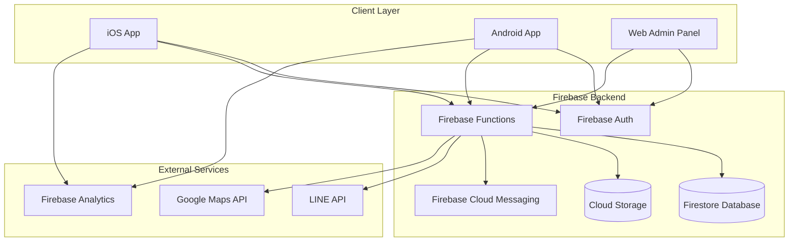
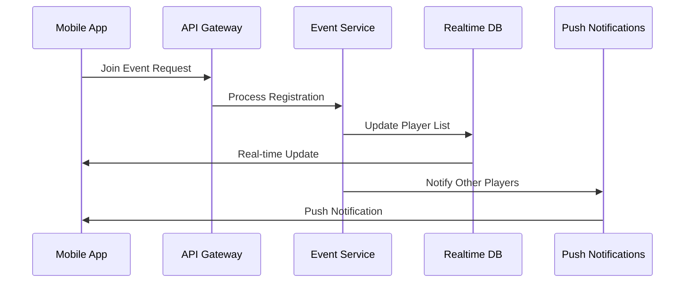
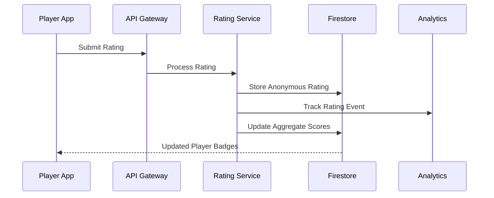

# VolleyCircle System Architecture

## 📋 Executive Summary

VolleyCircle is a cross-platform mobile application that solves the fundamental problem of skill-level matching in volleyball communities. The core innovation is a sophisticated rating system that helps players understand their true skill level and find games with similarly skilled players, making volleyball more enjoyable and competitive.

**Core Value Proposition**: Players rate each other after games relative to the game's skill level (S, A+, A, B+, B, C, under C), providing accurate skill assessment and enabling better game matching.

This document defines the comprehensive system architecture for this rating-centric volleyball community platform, targeting iOS and Android users primarily in Traditional Chinese markets with English support.

## 🎯 System Requirements

### Functional Requirements
- Cross-platform mobile app (iOS/Android)
- User authentication and profile management
- Event creation, discovery, and management
- Real-time player registration and waitlist management
- Multi-dimensional player rating system
- Host dashboard and attendance tracking
- Push notifications for event updates
- Integration with external chat platforms (LINE, Messenger)
- Internationalization (Traditional Chinese primary, English secondary)

### Non-Functional Requirements
- Support for 10,000+ concurrent users
- 99.9% uptime availability
- <2 second response times for critical operations
- Real-time synchronization across devices
- Offline capability for core features
- GDPR/privacy compliance
- Scalable to multiple regions

## 🏗️ Architecture Overview

### High-Level Architecture Pattern
**Simplified Firebase-First Architecture** for **MVP Development**

> **Note**: This simplified architecture is optimized for the 10-week MVP timeline. Post-MVP scaling to microservices is planned for Phase 2.



## 📱 Mobile Application Architecture

### Technology Stack
- **Framework**: React Native 0.72+ (chosen for strong community support, team expertise, and mature cross-platform ecosystem)
- **State Management**: Redux Toolkit + RTK Query
- **Navigation**: React Navigation 6
- **UI Components**: React Native Elements + Custom Design System
- **Internationalization**: react-i18next
- **Maps**: react-native-maps (Google Maps)
- **Push Notifications**: @react-native-firebase/messaging
- **Offline Storage**: @react-native-async-storage/async-storage
- **Real-time Updates**: Firebase Realtime Database SDK

### Application Structure
```
src/
├── components/           # Reusable UI components
│   ├── common/          # Generic components
│   ├── forms/           # Form-specific components
│   └── cards/           # Event/user cards
├── screens/             # Screen components
│   ├── auth/            # Authentication screens
│   ├── home/            # Home dashboard
│   ├── events/          # Event management
│   ├── profile/         # User profile
│   └── host/            # Host dashboard
├── services/            # API and business logic
│   ├── api/             # RTK Query API definitions
│   ├── firebase/        # Firebase configurations
│   └── utils/           # Utility functions
├── store/               # Redux store configuration
├── navigation/          # Navigation configuration
├── i18n/               # Internationalization
│   ├── locales/
│   │   ├── zh-TW.json   # Traditional Chinese
│   │   └── en.json      # English
└── constants/           # App constants and theme
```

### Design System Implementation
```javascript
// Theme configuration
const theme = {
  colors: {
    primary: '#FEC42F',      // Mikasa Yellow
    secondary: '#37474F',    // Dark Gray-Blue
    accent: '#1E88E5',       // Cool Blue
    surface: '#FFFFFF',
    background: '#F5F5F5',
    error: '#FF5252',
    success: '#4CAF50',
    warning: '#FF9800'
  },
  fonts: {
    regular: 'Inter-Regular',
    medium: 'Inter-Medium',
    bold: 'Inter-Bold',
    chinese: 'NotoSansTC-Regular'
  },
  spacing: {
    xs: 4,
    sm: 8,
    md: 16,
    lg: 24,
    xl: 32
  },
  borderRadius: {
    small: 8,
    medium: 16,
    large: 24
  }
};
```

## 🔧 Backend Services Architecture

### Technology Stack (MVP-Optimized)
- **Runtime**: Node.js 18+ with TypeScript
- **Framework**: Firebase Functions (serverless, no Express.js for MVP)
- **Database**: Firebase Firestore (primary), Realtime Database (deprecated for MVP)
- **Authentication**: Firebase Auth with custom claims
- **File Storage**: Firebase Cloud Storage
- **Hosting**: Firebase Functions + Firebase Hosting
- **Caching**: Browser/client-side caching (server-side caching deferred to post-MVP)
- **API Documentation**: Firebase REST API documentation

### Microservices Breakdown

#### 1. User Service
**Responsibilities:**
- User registration and profile management
- Skill level and preference management
- Privacy settings and profile visibility
- User statistics and achievement tracking

**API Endpoints:**
```typescript
// User management
POST   /api/v1/users/register
GET    /api/v1/users/profile
PUT    /api/v1/users/profile
DELETE /api/v1/users/account
GET    /api/v1/users/{userId}/public-profile
PUT    /api/v1/users/preferences
GET    /api/v1/users/statistics
```

#### 2. Event Service
**Responsibilities:**
- Event creation, modification, and cancellation
- Event discovery with filtering and search
- Player registration and waitlist management
- Location and venue management
- Event recommendations

**API Endpoints:**
```typescript
// Event management
POST   /api/v1/events
GET    /api/v1/events
GET    /api/v1/events/{eventId}
PUT    /api/v1/events/{eventId}
DELETE /api/v1/events/{eventId}
POST   /api/v1/events/{eventId}/join
DELETE /api/v1/events/{eventId}/leave
GET    /api/v1/events/search
GET    /api/v1/events/recommendations
POST   /api/v1/events/{eventId}/attendance
```

#### 3. Rating Service (CORE FEATURE)
**Responsibilities:**
- **Skill-level-relative rating collection** - Players rate others based on game skill level
- **Cross-level skill assessment** - Determine player's true skill across different game levels  
- **Anonymous feedback system** - Privacy-compliant rating collection
- **Skill profile aggregation** - Calculate player skill profiles across S, A+, A, B+, B, C, under C levels
- **Game matching recommendations** - Suggest appropriate skill level games for players
- **Rating statistics and badges** - Generate meaningful player insights
- **Reputation management** - Prevent abuse while maintaining anonymity

**API Endpoints:**
```typescript
// Core Rating System
POST   /api/v1/ratings/submit           // Submit rating after game
GET    /api/v1/ratings/user/{userId}   // Get user's skill profile
GET    /api/v1/ratings/event/{eventId} // Get event rating summary
GET    /api/v1/ratings/statistics      // Get rating analytics
GET    /api/v1/ratings/badges          // Get user badges/tags

// Skill Assessment & Matching
GET    /api/v1/skills/profile/{userId}       // Get detailed skill profile
GET    /api/v1/skills/recommendations/{userId} // Get recommended game levels
POST   /api/v1/skills/calculate              // Recalculate skill profile
GET    /api/v1/skills/leaderboard/{level}    // Get level-specific rankings
```

#### 4. Notification Service
**Responsibilities:**
- Push notification delivery
- Email notifications
- Notification preferences
- Event reminders and updates

**API Endpoints:**
```typescript
// Notification management
POST   /api/v1/notifications/send
GET    /api/v1/notifications/history
PUT    /api/v1/notifications/preferences
POST   /api/v1/notifications/device-token
DELETE /api/v1/notifications/device-token
```

### Database Schema Design

#### Firestore Collections Structure
```typescript
// Users collection
interface User {
  uid: string;
  email: string;
  displayName: string;
  profileImage?: string;
  skillLevel: 'S' | 'A+' | 'A' | 'B+' | 'B' | 'C' | 'under C';
  preferredPositions: string[];
  location?: GeoPoint;
  isPublicProfile: boolean;
  preferences: UserPreferences;
  statistics: UserStatistics;
  createdAt: Timestamp;
  updatedAt: Timestamp;
}

// Events collection (scalable design)
interface Event {
  id: string;
  title: string;
  description: string;
  hostId: string;
  netType: 'men' | 'women' | 'mixed';
  skillLevel: 'S' | 'A+' | 'A' | 'B+' | 'B' | 'C' | 'under C'; // Game's target skill level
  startTime: Timestamp;
  endTime: Timestamp;
  location: {
    name: string;
    address: string;
    coordinates: GeoPoint;
  };
  maxPlayers: number;
  currentPlayerCount: number; // Count instead of array
  waitlistCount: number; // Count instead of array
  fee: number;
  currency: string;
  chatLink?: string;
  tags: string[];
  status: 'open' | 'full' | 'cancelled' | 'completed';
  createdAt: Timestamp;
  updatedAt: Timestamp;
}

// Subcollections for scalability:
// events/{eventId}/players/{userId} - for current players
// events/{eventId}/waitlist/{userId} - for waitlisted players

// Ratings collection (CORE FEATURE - privacy-compliant)
interface Rating {
  id: string;
  eventId: string;
  gameSkillLevel: 'S' | 'A+' | 'A' | 'B+' | 'B' | 'C' | 'under C'; // Skill level of the game where rating occurred
  // raterId removed for true anonymity
  ratedUserId: string;
  dimensions: {
    friendliness: number; // 1-5 stars
    punctuality: number; // 1-5 stars  
    skillLevelRating: number; // 1-5 stars relative to the game's skill level
  };
  skillAssessment: {
    // Player's perceived skill level in this game context
    assessedLevel: 'S' | 'A+' | 'A' | 'B+' | 'B' | 'C' | 'under C';
    confidence: number; // 1-5, how confident the rater is about this assessment
  };
  tags: string[]; // e.g., "Strong Setter", "Good Team Player", "Powerful Spiker"
  comment?: string;
  // All ratings are anonymous by design
  createdAt: Timestamp;
}

// Player skill aggregation (derived from ratings)
interface PlayerSkillProfile {
  userId: string;
  skillLevels: {
    [level in 'S' | 'A+' | 'A' | 'B+' | 'B' | 'C' | 'under C']: {
      averageRating: number; // Average skill rating when playing at this level
      gamesPlayed: number; // Number of games played at this level
      ratingsReceived: number; // Number of ratings received at this level
      lastUpdated: Timestamp;
    }
  };
  primarySkillLevel: 'S' | 'A+' | 'A' | 'B+' | 'B' | 'C' | 'under C'; // Most common/confident level
  overallStats: {
    friendliness: number;
    punctuality: number;
    totalGamesPlayed: number;
    totalRatingsReceived: number;
  };
  badges: string[]; // Most common positive tags
  lastUpdated: Timestamp;
}

// Separate collection for abuse prevention (admin only)
interface RatingAudit {
  id: string;
  ratingId: string;
  raterId: string; // Stored separately for admin/audit purposes only
  eventId: string;
  createdAt: Timestamp;
}
```

#### Realtime Database Structure (for live updates)
```json
{
  "events": {
    "{eventId}": {
      "currentPlayers": ["{userId1}", "{userId2}"],
      "waitlist": ["{userId3}"],
      "lastUpdated": "timestamp"
    }
  },
  "presence": {
    "{userId}": {
      "online": true,
      "lastSeen": "timestamp"
    }
  }
}
```

## 🌐 Internationalization (i18n) Architecture

### Language Support Strategy
- **Primary**: Traditional Chinese (zh-TW)
- **Secondary**: English (en-US)
- **Future**: Simplified Chinese (zh-CN), Japanese (ja-JP)

### Implementation Approach
```typescript
// i18n configuration
import i18n from 'i18next';
import { initReactI18next } from 'react-i18next';
import AsyncStorage from '@react-native-async-storage/async-storage';

const LANGUAGE_DETECTOR = {
  type: 'languageDetector',
  async: true,
  detect: async (callback) => {
    const savedLanguage = await AsyncStorage.getItem('user-language');
    callback(savedLanguage || 'zh-TW');
  },
  init: () => {},
  cacheUserLanguage: async (language) => {
    await AsyncStorage.setItem('user-language', language);
  }
};

i18n
  .use(LANGUAGE_DETECTOR)
  .use(initReactI18next)
  .init({
    fallbackLng: 'zh-TW',
    resources: {
      'zh-TW': { translation: require('./locales/zh-TW.json') },
      'en': { translation: require('./locales/en.json') }
    }
  });
```

### Content Strategy
- **UI Text**: Stored in JSON resource files
- **Dynamic Content**: API-based translation with fallback
- **Skill Level Labels**: Localized display (S="專業級", A+="高級+", etc.)
- **Date/Time**: Locale-specific formatting
- **Number Formatting**: Currency and numeric localization

## 🔐 Security Architecture

### Authentication & Authorization
```typescript
// Firebase Auth configuration with custom claims
interface UserClaims {
  role: 'user' | 'host' | 'admin';
  verified: boolean;
  region: string;
}

// API middleware for authorization
const authorize = (requiredRole: string) => {
  return async (req: Request, res: Response, next: NextFunction) => {
    const token = req.headers.authorization?.split(' ')[1];
    const decodedToken = await admin.auth().verifyIdToken(token);
    
    if (!decodedToken.role || !hasPermission(decodedToken.role, requiredRole)) {
      return res.status(403).json({ error: 'Insufficient permissions' });
    }
    
    req.user = decodedToken;
    next();
  };
};
```

### Data Security Measures
- **Encryption**: All data encrypted at rest and in transit (TLS 1.3)
- **PII Protection**: Personal data anonymization for ratings
- **Rate Limiting**: API throttling and DDoS protection
- **Input Validation**: Comprehensive sanitization and validation
- **Audit Logging**: Security event tracking and monitoring

### Firebase Security Rules
```javascript
// Firestore security rules
rules_version = '2';
service cloud.firestore {
  match /databases/{database}/documents {
    // Users can only read/write their own profile
    match /users/{userId} {
      allow read, write: if request.auth != null && request.auth.uid == userId;
      allow read: if resource.data.isPublicProfile == true;
    }
    
    // Events are readable by all authenticated users
    match /events/{eventId} {
      allow read: if request.auth != null;
      allow write: if request.auth != null && 
        (request.auth.uid == resource.data.hostId || request.auth.token.role == 'admin');
    }
    
    // Ratings are write-only and anonymous
    match /ratings/{ratingId} {
      allow create: if request.auth != null && 
        request.auth.uid == request.resource.data.raterId;
      allow read: if request.auth != null && request.auth.token.role == 'admin';
    }
  }
}
```

## 📊 Monitoring & Analytics

### Performance Monitoring
- **Firebase Performance**: App performance tracking
- **Crashlytics**: Crash reporting and analysis
- **Custom Metrics**: Business KPIs and user engagement
- **Real-time Monitoring**: System health dashboards

### Analytics Implementation
```typescript
// Analytics tracking
import analytics from '@react-native-firebase/analytics';

export const trackEvent = {
  eventCreated: (eventType: string, playerCount: number) => {
    analytics().logEvent('event_created', {
      event_type: eventType,
      player_count: playerCount
    });
  },
  
  playerJoined: (eventId: string, skillLevel: string) => {
    analytics().logEvent('player_joined', {
      event_id: eventId,
      skill_level: skillLevel
    });
  },
  
  ratingSubmitted: (dimensions: string[]) => {
    analytics().logEvent('rating_submitted', {
      dimensions: dimensions.join(',')
    });
  }
};
```

## 🚀 Deployment Architecture

### Environment Strategy
- **Development**: Local Firebase emulators + dev Firestore
- **Staging**: Isolated Firebase project for testing
- **Production**: Production Firebase project with global CDN

### CI/CD Pipeline
```yaml
# GitHub Actions workflow
name: VolleyCircle Deploy
on:
  push:
    branches: [main, develop]

jobs:
  mobile-build:
    runs-on: macos-latest
    steps:
      - uses: actions/checkout@v3
      - name: Setup React Native
        uses: ./.github/actions/setup-rn
      - name: Run tests
        run: npm test
      - name: Build iOS
        run: cd ios && xcodebuild -workspace VolleyCircle.xcworkspace
      - name: Build Android
        run: cd android && ./gradlew assembleRelease

  deploy-functions:
    runs-on: ubuntu-latest
    steps:
      - uses: actions/checkout@v3
      - name: Deploy to Firebase
        uses: FirebaseExtended/action-hosting-deploy@v0
        with:
          repoToken: '${{ secrets.GITHUB_TOKEN }}'
          firebaseServiceAccount: '${{ secrets.FIREBASE_SERVICE_ACCOUNT }}'
```

## 📈 Scalability Considerations

### Performance Optimization
- **Lazy Loading**: Component and screen-based code splitting
- **Image Optimization**: WebP format with multiple resolutions
- **Caching Strategy**: Multi-layer caching (device, CDN, database)
- **Database Optimization**: Proper indexing and query optimization

### Future Scalability
- **Horizontal Scaling**: Microservices can scale independently
- **Geographic Distribution**: Multi-region deployment capability
- **Load Balancing**: Auto-scaling based on demand
- **Database Sharding**: User-based partitioning for large datasets

## 🔄 Data Flow Architecture

### Real-time Event Updates


### Rating System Flow


## 🏐 Core Rating System Logic

### Skill Assessment Algorithm

The rating system is the cornerstone of VolleyCircle, solving the fundamental problem of skill-level mismatch in volleyball communities.

#### How It Works:
1. **Game Context**: Every game has a designated skill level (S, A+, A, B+, B, C, under C)
2. **Relative Rating**: Players rate others based on performance *relative to that game's skill level*
3. **Cross-Level Analysis**: System aggregates ratings across different game levels to determine true skill
4. **Dynamic Profiling**: Player skill profiles update after each rated game

#### Rating Calculation:
```typescript
// Skill level confidence calculation
function calculateSkillConfidence(level: SkillLevel, ratings: Rating[]): number {
  const levelRatings = ratings.filter(r => r.gameSkillLevel === level);
  const avgRating = levelRatings.reduce((sum, r) => sum + r.dimensions.skillLevelRating, 0) / levelRatings.length;
  const confidence = Math.min(levelRatings.length / 5, 1); // Max confidence after 5 games
  return avgRating * confidence;
}

// Primary skill level determination
function determinePrimarySkillLevel(profile: PlayerSkillProfile): SkillLevel {
  const levels = Object.entries(profile.skillLevels)
    .filter(([_, data]) => data.ratingsReceived >= 3) // Minimum threshold
    .sort(([_, a], [__, b]) => {
      const confidenceA = calculateSkillConfidence(_, ratings);
      const confidenceB = calculateSkillConfidence(__, ratings);
      return confidenceB - confidenceA;
    });
  
  return levels[0]?.[0] as SkillLevel || 'C'; // Default to C if no ratings
}
```

#### Game Matching Logic:
- **Exact Match**: Recommend games at player's primary skill level
- **Challenge Mode**: Suggest games 1 level above (if confidence is high)
- **Comfort Zone**: Suggest games 1 level below (for practice or fun)
- **Avoid Mismatch**: Prevent >2 level differences to maintain game quality

### Privacy & Anonymity
- **Zero-Knowledge Rating**: `raterId` never stored with rating data
- **Audit Trail**: Separate encrypted audit log for abuse prevention only
- **Aggregated Display**: Only show statistical summaries, never individual ratings
- **Retroactive Protection**: Players can't identify who rated them

This comprehensive system architecture provides a scalable, maintainable foundation for the VolleyCircle platform, with the rating system as the core feature solving skill-level matching challenges.