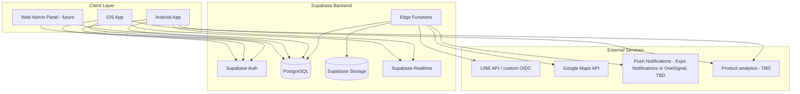
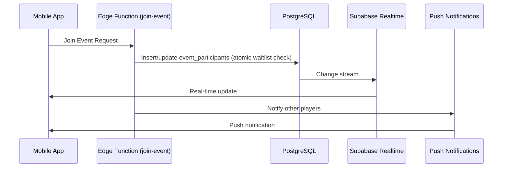
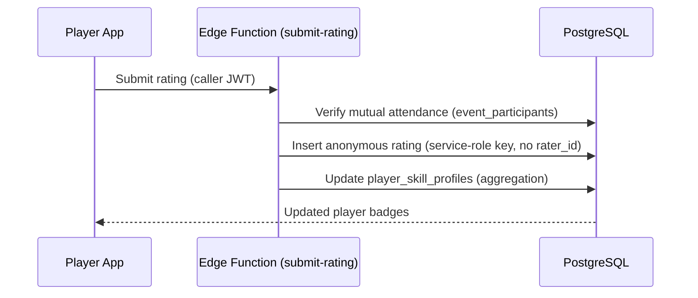

# VolleyCircle System Architecture

## 📋 Executive Summary

VolleyCircle is a cross-platform mobile application that solves the fundamental problem of skill-level matching in volleyball communities. The core innovation is a sophisticated rating system that helps players understand their true skill level and find games with similarly skilled players, making volleyball more enjoyable and competitive.

**Core Value Proposition**: Players rate each other after games relative to the game's skill level (S, A+, A, B+, B, C, under C), providing accurate skill assessment and enabling better game matching.

This document defines the comprehensive system architecture for this rating-centric volleyball community platform, targeting iOS and Android users primarily in Traditional Chinese markets with English support.

## 🎯 System Requirements

### Functional Requirements
- Cross-platform mobile app (iOS/Android)
- User authentication and profile management
- Event creation, discovery, and management
- Real-time player registration and waitlist management
- Multi-dimensional player rating system
- Host dashboard and attendance tracking
- Push notifications for event updates
- Integration with external chat platforms (LINE, Messenger)
- Internationalization (Traditional Chinese primary, English secondary)

### Non-Functional Requirements
- Support for 10,000+ concurrent users
- 99.9% uptime availability
- <2 second response times for critical operations
- Real-time synchronization across devices
- Offline capability for core features
- GDPR/privacy compliance
- Scalable to multiple regions

## 🏗️ Architecture Overview

### High-Level Architecture Pattern
**Supabase-First Architecture** for **MVP Development**

Per [ADR-002](../adr/ADR-002-migrate-backend-firebase-to-supabase.md), the backend is Supabase (PostgreSQL + Auth + Realtime + Storage + Edge Functions); per [ADR-003](../adr/ADR-003-expo-and-repo-layout.md), the app is Expo managed workflow with EAS Build.

> **Note**: This simplified architecture is optimized for the 12-week MVP timeline (see [roadmap](volleyball_mvp_roadmap.md)). Post-MVP scaling considerations are in the [Scalability Considerations](#-scalability-considerations) section below.



Unlike the earlier Firebase design, there is no separate "Functions" tier sitting in front of every read/write: the Supabase client talks to PostgreSQL directly (via the auto-generated PostgREST API), gated by Row Level Security. Edge Functions are reserved for logic that must not run on the client — most importantly, anonymous rating submission (see [Privacy & Anonymity](#privacy--anonymity)).

## 📱 Mobile Application Architecture

### Technology Stack
- **Framework**: React Native via **Expo** managed workflow (chosen per [ADR-003](../adr/ADR-003-expo-and-repo-layout.md) — EAS Build, no committed native `ios`/`android` folders; `expo prebuild` is the escape hatch)
- **State Management**: Redux Toolkit + RTK Query
- **Navigation**: React Navigation 6
- **UI Components**: React Native Elements + Custom Design System
- **Internationalization**: react-i18next
- **Maps**: react-native-maps (Google Maps)
- **Push Notifications**: Expo Notifications or OneSignal — decision deferred (see ADR-002 Consequences; Supabase has no built-in push service)
- **Offline Storage**: @react-native-async-storage/async-storage
- **Real-time Updates**: Supabase Realtime (Postgres change streams over WebSocket)
- **Backend Client**: `@supabase/supabase-js`

### Application Structure
Feature-first layout per [ADR-003](../adr/ADR-003-expo-and-repo-layout.md), so folders map 1:1 onto the sub-agent CODEOWNERS model:
```
app/src/
├── features/
│   ├── rating/          # CORE — skill-level-relative rating flows
│   ├── events/          # event creation, discovery, join/waitlist
│   ├── host/             # host dashboard, attendance tracking
│   └── profile/          # auth, profile setup, availability
├── components/            # shared/reusable UI components
├── lib/
│   └── supabase.ts        # Supabase client init (Auth, DB, Realtime, Storage)
├── navigation/             # React Navigation config
├── i18n/
│   └── locales/
│       ├── zh-TW.json      # Traditional Chinese
│       └── en.json         # English
└── constants/              # theme, app constants
```

### Design System Implementation
```javascript
// Theme configuration
const theme = {
  colors: {
    primary: '#FEC42F',      // Mikasa Yellow
    secondary: '#37474F',    // Dark Gray-Blue
    accent: '#1E88E5',       // Cool Blue
    surface: '#FFFFFF',
    background: '#F5F5F5',
    error: '#FF5252',
    success: '#4CAF50',
    warning: '#FF9800'
  },
  fonts: {
    regular: 'Inter-Regular',
    medium: 'Inter-Medium',
    bold: 'Inter-Bold',
    chinese: 'NotoSansTC-Regular'
  },
  spacing: {
    xs: 4,
    sm: 8,
    md: 16,
    lg: 24,
    xl: 32
  },
  borderRadius: {
    small: 8,
    medium: 16,
    large: 24
  }
};
```

## 🔧 Backend Services Architecture

### Technology Stack (MVP-Optimized)
- **Runtime**: Deno + TypeScript (Supabase Edge Functions)
- **Framework**: Supabase Edge Functions — used only for logic that can't run as a plain client query (rating submission/aggregation, LINE OIDC, notification fan-out). Most CRUD goes through the auto-generated PostgREST API, not hand-written routes.
- **Database**: PostgreSQL (Supabase-managed) — single relational store; no separate realtime database needed, since Supabase Realtime streams changes from Postgres directly
- **Authentication**: Supabase Auth (GoTrue) — Google/Facebook as native OAuth providers; LINE via custom OIDC/Edge Function (not a built-in provider, per ADR-003)
- **File Storage**: Supabase Storage
- **Hosting**: TBD — Supabase does not include app/web hosting the way Firebase Hosting did (see [CLAUDE.md](../../CLAUDE.md)); Edge Functions are hosted by Supabase itself, app binaries ship via EAS/app stores
- **Caching**: Browser/client-side caching (server-side caching deferred to post-MVP)
- **API Documentation**: Auto-generated PostgREST OpenAPI spec (via Supabase Studio) + inline docs in `supabase/functions/**`

### Backend Responsibilities

Supabase isn't split into independently-deployed microservices — it's one Postgres database with RLS-scoped tables, plus a small set of Edge Functions for logic that must run server-side. The groupings below describe responsibility areas, not separate deployables.

#### 1. Profile / Auth
**Responsibilities:**
- User registration and profile management (via Supabase Auth + a `profiles` table)
- Skill level and preference management
- Privacy settings and profile visibility
- User statistics and achievement tracking

**Access pattern:**
- Most reads/writes: Supabase client directly against `profiles`, gated by RLS (`auth.uid() = id` for own profile; public read if `is_public_profile`).
- Custom logic (account deletion cascades, statistics recompute): Edge Function.

#### 2. Events
**Responsibilities:**
- Event creation, modification, and cancellation
- Event discovery with filtering and search
- Player registration and waitlist management
- Location and venue management
- Event recommendations

**Access pattern:**
- CRUD via Supabase client against `events`, RLS: read = any authenticated user, write = host or admin only.
- Join/leave: `join-event` Edge Function — handles waitlist promotion atomically (avoids race conditions two direct client writes would have).
- Search/recommendations: Postgres RPC function (`supabase.rpc('search_events', {...})`) for filter/geo queries; skill-match scoring in an Edge Function once rating data exists.

#### 3. Rating (CORE FEATURE)
**Responsibilities:**
- **Skill-level-relative rating collection** - Players rate others based on game skill level
- **Cross-level skill assessment** - Determine player's true skill across different game levels
- **Anonymous feedback system** - Privacy-compliant rating collection
- **Skill profile aggregation** - Calculate player skill profiles across S, A+, A, B+, B, C, under C levels
- **Game matching recommendations** - Suggest appropriate skill level games for players
- **Rating statistics and badges** - Generate meaningful player insights
- **Reputation management** - Prevent abuse while maintaining anonymity

**Access pattern:**
- Submission: `submit-rating` Edge Function, called with the caller's JWT. The function verifies mutual attendance via `event_participants`, then inserts into `ratings` using the **service-role key** — the table has no rater-identity column at all, so anonymity doesn't depend on an RLS policy hiding a column that exists (see [Privacy & Anonymity](#privacy--anonymity)).
- Aggregation: Edge Function (or a scheduled `pg_cron` job) recomputes `player_skill_profiles` after each rating batch.
- Reads: Supabase client queries `player_skill_profiles` directly — public/aggregate columns only, RLS-gated.

#### 4. Notifications
**Responsibilities:**
- Push notification delivery
- Notification preferences
- Event reminders and updates

**Access pattern:**
- Not a Supabase-native service — push delivery goes through Expo Notifications or OneSignal (decision pending, see ADR-002 Consequences).
- A `device_tokens` table stores push tokens; a Postgres trigger or Edge Function fires on relevant events (new join, rating reminder, event change) and calls the push provider's API.

### Database Schema Design

#### PostgreSQL Schema (Supabase)
```sql
-- Profiles (extends Supabase's built-in auth.users)
CREATE TABLE profiles (
  id                    UUID PRIMARY KEY REFERENCES auth.users(id) ON DELETE CASCADE,
  display_name          TEXT NOT NULL,
  profile_image         TEXT,
  skill_level           TEXT CHECK (skill_level IN ('S','A+','A','B+','B','C','under C')),
  preferred_positions   TEXT[],
  is_public_profile     BOOLEAN NOT NULL DEFAULT false,
  created_at            TIMESTAMPTZ NOT NULL DEFAULT now(),
  updated_at            TIMESTAMPTZ NOT NULL DEFAULT now()
);

-- Events
CREATE TABLE events (
  id                UUID PRIMARY KEY DEFAULT gen_random_uuid(),
  host_id           UUID NOT NULL REFERENCES profiles(id),
  title             TEXT NOT NULL,
  description       TEXT,
  net_type          TEXT CHECK (net_type IN ('men','women','mixed')),
  skill_level       TEXT CHECK (skill_level IN ('S','A+','A','B+','B','C','under C')), -- game's target skill level
  start_time        TIMESTAMPTZ NOT NULL,
  end_time          TIMESTAMPTZ NOT NULL,
  location_name     TEXT,
  location_address  TEXT,
  max_players       INT NOT NULL,
  fee               NUMERIC(10,2) NOT NULL DEFAULT 0,
  currency          TEXT NOT NULL DEFAULT 'TWD',
  chat_link         TEXT,
  tags              TEXT[],
  status            TEXT NOT NULL CHECK (status IN ('open','full','cancelled','completed')) DEFAULT 'open',
  created_at        TIMESTAMPTZ NOT NULL DEFAULT now(),
  updated_at        TIMESTAMPTZ NOT NULL DEFAULT now()
);

-- Event participants (replaces the players/waitlist subcollections from the old Firestore design)
CREATE TABLE event_participants (
  event_id    UUID NOT NULL REFERENCES events(id) ON DELETE CASCADE,
  user_id     UUID NOT NULL REFERENCES profiles(id) ON DELETE CASCADE,
  status      TEXT NOT NULL CHECK (status IN ('confirmed','waitlisted')),
  attended    BOOLEAN, -- set by host at check-in; gates rating eligibility
  joined_at   TIMESTAMPTZ NOT NULL DEFAULT now(),
  PRIMARY KEY (event_id, user_id)
);

-- Ratings (CORE FEATURE) — deliberately has NO rater-identity column.
-- Anonymity is structural, not RLS-enforced: nothing links a row back to its author.
CREATE TABLE ratings (
  id                   UUID PRIMARY KEY DEFAULT gen_random_uuid(),
  event_id             UUID NOT NULL REFERENCES events(id),
  game_skill_level     TEXT CHECK (game_skill_level IN ('S','A+','A','B+','B','C','under C')), -- skill level of the game where rating occurred
  rated_user_id        UUID NOT NULL REFERENCES profiles(id),
  friendliness         SMALLINT CHECK (friendliness BETWEEN 1 AND 5),
  punctuality          SMALLINT CHECK (punctuality BETWEEN 1 AND 5),
  skill_level_rating   SMALLINT CHECK (skill_level_rating BETWEEN 1 AND 5), -- relative to the game's skill level
  assessed_level       TEXT CHECK (assessed_level IN ('S','A+','A','B+','B','C','under C')),
  confidence           SMALLINT CHECK (confidence BETWEEN 1 AND 5), -- how confident the rater is about the assessment
  tags                 TEXT[], -- e.g. "Strong Setter", "Good Team Player"
  comment              TEXT,
  is_host_rating       BOOLEAN NOT NULL DEFAULT false, -- host ratings get extra weight in aggregation
  created_at           TIMESTAMPTZ NOT NULL DEFAULT now()
);

-- Player skill aggregation (derived from ratings, recomputed by an Edge Function)
CREATE TABLE player_skill_profiles (
  user_id                    UUID PRIMARY KEY REFERENCES profiles(id),
  skill_levels               JSONB NOT NULL DEFAULT '{}', -- { level: { average_rating, games_played, ratings_received, last_updated } }
  primary_skill_level        TEXT CHECK (primary_skill_level IN ('S','A+','A','B+','B','C','under C')),
  overall_friendliness       NUMERIC(3,2),
  overall_punctuality        NUMERIC(3,2),
  total_games_played         INT NOT NULL DEFAULT 0,
  total_ratings_received     INT NOT NULL DEFAULT 0,
  badges                     TEXT[], -- most common positive tags
  last_updated                TIMESTAMPTZ NOT NULL DEFAULT now()
);
```

#### Row Level Security (replaces Firebase Security Rules)
```sql
ALTER TABLE profiles ENABLE ROW LEVEL SECURITY;
CREATE POLICY "read own or public profile" ON profiles FOR SELECT
  USING (auth.uid() = id OR is_public_profile);
CREATE POLICY "update own profile" ON profiles FOR UPDATE
  USING (auth.uid() = id);

ALTER TABLE events ENABLE ROW LEVEL SECURITY;
CREATE POLICY "read events" ON events FOR SELECT USING (true); -- any authenticated user
CREATE POLICY "host manages own events" ON events FOR ALL
  USING (auth.uid() = host_id);

ALTER TABLE ratings ENABLE ROW LEVEL SECURITY;
-- No INSERT policy for the `authenticated` role: all writes go through the
-- submit-rating Edge Function using the service-role key, which verifies
-- mutual attendance first. Raw rows are never client-readable either.
CREATE POLICY "no direct client reads of raw ratings" ON ratings FOR SELECT USING (false);

ALTER TABLE player_skill_profiles ENABLE ROW LEVEL SECURITY;
CREATE POLICY "read own or public skill profile" ON player_skill_profiles FOR SELECT
  USING (
    auth.uid() = user_id
    OR EXISTS (SELECT 1 FROM profiles WHERE id = user_id AND is_public_profile)
  );
```

#### Realtime (replaces the Firestore Listeners / Realtime Database design)
There's no separate realtime database — Postgres is the single source of truth, and Supabase Realtime streams change events from it directly:
```typescript
// Live participant-count updates for an event
supabase
  .channel(`event:${eventId}`)
  .on(
    'postgres_changes',
    { event: '*', schema: 'public', table: 'event_participants', filter: `event_id=eq.${eventId}` },
    handleParticipantChange
  )
  .subscribe();
```

## 🌐 Internationalization (i18n) Architecture

### Language Support Strategy
- **Primary**: Traditional Chinese (zh-TW)
- **Secondary**: English (en-US)
- **Future**: Simplified Chinese (zh-CN), Japanese (ja-JP)

### Implementation Approach
```typescript
// i18n configuration
import i18n from 'i18next';
import { initReactI18next } from 'react-i18next';
import AsyncStorage from '@react-native-async-storage/async-storage';

const LANGUAGE_DETECTOR = {
  type: 'languageDetector',
  async: true,
  detect: async (callback) => {
    const savedLanguage = await AsyncStorage.getItem('user-language');
    callback(savedLanguage || 'zh-TW');
  },
  init: () => {},
  cacheUserLanguage: async (language) => {
    await AsyncStorage.setItem('user-language', language);
  }
};

i18n
  .use(LANGUAGE_DETECTOR)
  .use(initReactI18next)
  .init({
    fallbackLng: 'zh-TW',
    resources: {
      'zh-TW': { translation: require('./locales/zh-TW.json') },
      'en': { translation: require('./locales/en.json') }
    }
  });
```

### Content Strategy
- **UI Text**: Stored in JSON resource files
- **Dynamic Content**: API-based translation with fallback
- **Skill Level Labels**: Localized display (S="專業級", A+="高級+", etc.)
- **Date/Time**: Locale-specific formatting
- **Number Formatting**: Currency and numeric localization

## 🔐 Security Architecture

### Authentication & Authorization
Supabase Auth issues a JWT per session; RLS policies read claims from it directly (`auth.uid()`, `auth.jwt()`), so there's no separate authorization middleware layer to maintain:
```sql
-- Example: restrict a policy to users with an admin role
-- (role is stored in auth.users.raw_app_meta_data, set via the Supabase Admin API)
CREATE POLICY "admin only" ON some_table FOR ALL
  USING ((auth.jwt() -> 'app_metadata' ->> 'role') = 'admin');
```
```typescript
// Edge Functions that need to act as a specific caller (not bypass RLS)
// forward the caller's JWT to a per-request Supabase client instead of using
// the service-role key:
const supabase = createClient(SUPABASE_URL, SUPABASE_ANON_KEY, {
  global: { headers: { Authorization: req.headers.get('Authorization')! } }
});
```
The `submit-rating` function is the deliberate exception — it uses the service-role key (which bypasses RLS) precisely so it can insert into `ratings` without any client-facing insert policy existing at all.

### Data Security Measures
- **Encryption**: All data encrypted at rest and in transit (TLS 1.3)
- **PII Protection**: Personal data anonymization for ratings (structural — see Database Schema Design)
- **Rate Limiting**: API throttling and DDoS protection
- **Input Validation**: Comprehensive sanitization and validation
- **Audit Logging**: Security event tracking and monitoring

## 📊 Monitoring & Analytics

Supabase Studio provides basic API/DB metrics (query performance, request counts) but is not a replacement for app-side crash reporting or product analytics.

- **Crash reporting / performance monitoring**: TBD — no built-in Supabase equivalent to Firebase Crashlytics/Performance; decide during Phase 1 (Sentry is a common Expo-compatible choice, not yet committed)
- **Product analytics**: TBD — decide during Phase 1 (e.g. PostHog, Amplitude)
- **Custom Metrics**: Business KPIs and user engagement, tracked once an analytics tool is chosen

### Analytics Implementation (event names — client TBD)
```typescript
// analytics client: TBD (see above) — event shape kept stable regardless of vendor
export const trackEvent = {
  eventCreated: (eventType: string, playerCount: number) => {
    analytics.track('event_created', {
      event_type: eventType,
      player_count: playerCount
    });
  },

  playerJoined: (eventId: string, skillLevel: string) => {
    analytics.track('player_joined', {
      event_id: eventId,
      skill_level: skillLevel
    });
  },

  ratingSubmitted: (dimensions: string[]) => {
    analytics.track('rating_submitted', {
      dimensions: dimensions.join(',')
    });
  }
};
```

## 🚀 Deployment Architecture

### Environment Strategy
- **Development**: `supabase start` local stack (Postgres + Auth + Storage + Studio) + Expo Go / EAS dev client
- **Staging**: Separate Supabase project + EAS internal distribution build
- **Production**: Production Supabase project + EAS production build submitted to App Store/Play Store

### CI/CD Pipeline
```yaml
# GitHub Actions workflow
name: VolleyCircle Deploy
on:
  push:
    branches: [main, develop]

jobs:
  eas-build:
    runs-on: ubuntu-latest
    steps:
      - uses: actions/checkout@v3
      - name: EAS Build (iOS + Android, cloud)
        run: eas build --platform all --non-interactive
        env:
          EXPO_TOKEN: ${{ secrets.EXPO_TOKEN }}

  deploy-supabase:
    runs-on: ubuntu-latest
    steps:
      - uses: actions/checkout@v3
      - name: Push migrations + deploy Edge Functions
        run: |
          supabase db push
          supabase functions deploy --project-ref ${{ secrets.SUPABASE_PROJECT_REF }}
        env:
          SUPABASE_ACCESS_TOKEN: ${{ secrets.SUPABASE_ACCESS_TOKEN }}
```
No local `xcodebuild`/`gradlew` steps — EAS Build replaces both with a single cloud job (per ADR-003).

## 📈 Scalability Considerations

### Performance Optimization
- **Lazy Loading**: Component and screen-based code splitting
- **Image Optimization**: WebP format with multiple resolutions
- **Caching Strategy**: Multi-layer caching (device, CDN, database)
- **Database Optimization**: Proper indexing and query optimization

### Future Scalability
- **Postgres scaling**: Connection pooling (Supavisor) and read replicas as load grows — full SQL means no data-duplication workarounds for complex queries (a Firestore limitation noted in ADR-002)
- **Edge Functions**: Scale independently as serverless compute; no capacity planning needed for the CRUD path since PostgREST talks to Postgres directly
- **Geographic Distribution**: Multi-region deployment capability (Supabase project region selection; revisit if latency becomes an issue)
- **Database Sharding**: User-based partitioning for large datasets, if ever needed post-MVP

## 🔄 Data Flow Architecture

### Real-time Event Updates


### Rating System Flow


## 🏐 Core Rating System Logic

### Skill Assessment Algorithm

The rating system is the cornerstone of VolleyCircle, solving the fundamental problem of skill-level mismatch in volleyball communities.

#### How It Works:
1. **Game Context**: Every game has a designated skill level (S, A+, A, B+, B, C, under C)
2. **Relative Rating**: Players rate others based on performance *relative to that game's skill level*
3. **Cross-Level Analysis**: System aggregates ratings across different game levels to determine true skill
4. **Dynamic Profiling**: Player skill profiles update after each rated game

#### Rating Calculation:
```typescript
// Skill level confidence calculation
function calculateSkillConfidence(level: SkillLevel, ratings: Rating[]): number {
  const levelRatings = ratings.filter(r => r.gameSkillLevel === level);
  const avgRating = levelRatings.reduce((sum, r) => sum + r.dimensions.skillLevelRating, 0) / levelRatings.length;
  const confidence = Math.min(levelRatings.length / 5, 1); // Max confidence after 5 games
  return avgRating * confidence;
}

// Primary skill level determination
function determinePrimarySkillLevel(profile: PlayerSkillProfile, ratings: Rating[]): SkillLevel {
  const levels = Object.entries(profile.skillLevels)
    .filter(([_, data]) => data.ratingsReceived >= 3) // Minimum threshold
    .sort(([levelA], [levelB]) => {
      const confidenceA = calculateSkillConfidence(levelA as SkillLevel, ratings);
      const confidenceB = calculateSkillConfidence(levelB as SkillLevel, ratings);
      return confidenceB - confidenceA;
    });

  return (levels[0]?.[0] as SkillLevel) || 'C'; // Default to C if no ratings
}
```
This aggregation runs inside an Edge Function (or a scheduled `pg_cron` job) after ratings are inserted — never on the client, since it needs to read across all ratings for a player.

#### Game Matching Logic:
- **Exact Match**: Recommend games at player's primary skill level
- **Challenge Mode**: Suggest games 1 level above (if confidence is high)
- **Comfort Zone**: Suggest games 1 level below (for practice or fun)
- **Avoid Mismatch**: Prevent >2 level differences to maintain game quality

### Privacy & Anonymity
- **Structural anonymity**: The `ratings` table has no rater-identity column at all — not "stored then hidden by a rule," but never captured in the first place. See [Database Schema Design](#database-schema-design).
- **Validation without identity**: Mutual-participation checks ("can this caller rate this player?") happen inside the `submit-rating` Edge Function against `event_participants`, using the caller's JWT to identify *them*, before the function switches to the service-role key to perform the actual insert — so the validation step and the storage step use different credentials, and only the validation step ever sees who's rating whom.
- **Aggregated Display**: Only show statistical summaries (`player_skill_profiles`), never individual ratings — enforced by RLS denying all direct `SELECT`s on `ratings`.
- **Retroactive Protection**: Since no rater identity is ever persisted, there's nothing for a data breach or admin query to expose — this is stronger than Firebase's original design, which kept a separate `RatingAudit` collection with `raterId` for abuse prevention. If abuse prevention needs a paper trail later, it should be a short-retention log outside the `ratings` table, not a permanent link.

This comprehensive system architecture provides a scalable, maintainable foundation for the VolleyCircle platform, with the rating system as the core feature solving skill-level matching challenges.
