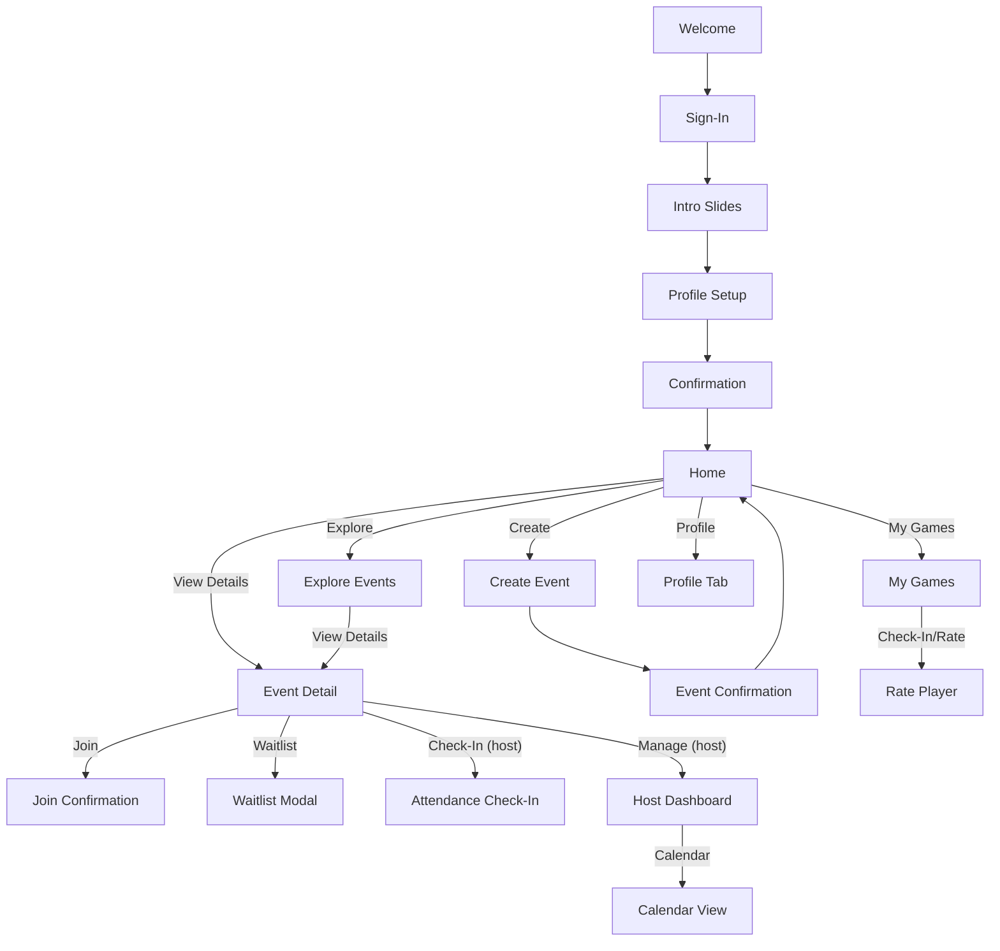

**🏐 VolleyCircle: A Volleyball Community Platform — Product Overview**

VolleyCircle is a skill-level matching platform that solves the fundamental problem of finding volleyball games with players at your actual skill level. The core innovation is a sophisticated rating system where players rate each other relative to the game's skill level (S, A+, A, B+, B, C, under C), helping everyone understand their true abilities and find more enjoyable, competitive games.

**The Problem**: It's difficult for volleyball players to accurately assess their skill level and find games with similarly skilled players, leading to mismatched games that are less fun for everyone.

**The Solution**: A skill-level-relative rating system that provides accurate skill assessment through peer feedback after games, enabling better game matching and more enjoyable volleyball experiences.

---

### 📖 Table of Contents

1. Product Overview
2. Design System & Tech Stack
3. Feature List
4. MVP Roadmap
5. Future Opportunities
6. Main Navigation & Figma Prototype Spec
7. Core UI & UX Flows (Screens)
8. Player & Host Rating System

---

### 🎨 Design System (Colors & Fonts)

| Element              | Spec                                     |
| -------------------- | ---------------------------------------- |
| **Primary Color**    | #FEC42F (Mikasa Yellow)                  |
| **Secondary Color**  | #37474F (Dark Gray-Blue)                 |
| **Accent/Highlight** | #1E88E5 (Cool Blue for links/buttons)    |
| **Font**             | Inter (English), Noto Sans TC (Chinese)  |
| **Corner Radius**    | 16px for cards, buttons                  |
| **Icons**            | Lucide or Material Icons, outlined style |

---

### 🛠️ Tech Stack Recommendation

These technologies support a fast, scalable MVP with minimal infrastructure overhead:

- **Frontend:** React Native for cross-platform mobile development (chosen for strong community support, team expertise, and mature ecosystem)
- **Backend:** Firebase (Firestore Database + Authentication + Functions)
- **Notifications:** Firebase Cloud Messaging for event alerts and reminders
- **Hosting:** Firebase Hosting or Vercel for serving any web admin interfaces or landing pages

---

### Feature List

A quick reference to all major platform features:

- User Registration & Login (OAuth)
- Profile Setup & Skill Tags
- Home Feed (Upcoming Events, Recommendations, Rejoin Suggestions)
- Event Creation & Discovery (with filter/sort)
- Join/Leave Events
- External Chatroom Links
- **Skill-Level-Relative Rating System** (core feature - multi-dimension, skill-context-aware, anonymous)
- Admin Dashboard (event management, attendance, calendar view)
- Social Profiles & Player Discovery (deferred)
- Club & League Management (deferred)
- QR Check-in & Metrics Panel (deferred)

---

### 🗺️ MVP Roadmap (Trimmed for Initial Release)

#### **Phase 1: Foundation (Weeks 1–4)**

- User Registration & Login (OAuth via Google/LINE/Facebook)
- Profile Setup (Name, Skill Level, Preferred Position, Availability)
- Skill Level System (S, A+, A, B+, B, C, under C)
- Firebase project setup and basic security rules

#### **Phase 2: Core Rating System (Weeks 5–7)**

- **Skill-Level-Relative Rating System** (CORE FEATURE)
  - Post-game rating interface with skill level context
  - Anonymous rating collection (friendliness, punctuality, skill assessment)
  - Skill level assessment relative to game level (S, A+, A, B+, B, C, under C)
  - Player skill profile aggregation across different game levels
- Basic event creation and discovery (simplified for MVP)
- Join/Leave Events + Confirmation

#### **Phase 3: Game Management (Weeks 8–10)**

- Enhanced Event Creation Module (detailed fields and validation)
- Event Discovery Module
  - **Skill-based filtering and recommendations** (using rating system data)
  - Filter by date, location, and skill level
  - Show real-time slot availability
- Add External Chatroom Link (LINE, Messenger)
- Basic push notifications
- **Game matching recommendations** based on player skill profiles

#### **Phase 4: Host Tools (Weeks 11–12)**

- Host Dashboard (My Events management)
- Manual Attendance Tracking (Check-in / Late / No Show)
- Calendar View for Gym Owners
- App Store submission and review process

> **Note**: Timeline extended to 12 weeks to accommodate technical complexity and app store approval process.

#### **Deferred Features for Future Releases**

- QR Code Check-in
- Follow Organizer
- Rejoin History
- Host Metrics Panel
- League & Club System
- In-app Chat
- Tournament & Team Registration
- Location Heatmap for Popular Games
- Player Skill Tracking with Visual History

---

### 💡 Future Opportunities & Discussion Topics

#### 1. Community Engagement

- Player leveling system or badges
- Weekly MVP or attendance streak rewards
- Referral program to grow user base

#### 2. Club & League Features

- Organize clubs or player groups
- Enable league creation and management
  - Schedule games between teams
  - Display standings, win/loss records, and rankings

#### 3. Gym & Host Expansion

- Host subscription model (e.g., pro features or analytics)
- Gym rental booking with payments
- API integration with gym scheduling software

#### 4. Social Profiles & Player Discovery

- Add Friends and build a trusted playing circle
- Search and view public player profiles
  - Includes rating summaries, event history, attendance, and tags
- Player tags are highlighted as badges on their profile
- Optional privacy settings for profile visibility

---

### Main Navigation (Bottom Tab Bar)

This navigation layout helps users quickly access all major parts of the app with a focus on simplicity and clarity.

**Tabs & Destinations:**

| Tab          | Icon     | Description                                                     |
| ------------ | -------- | --------------------------------------------------------------- |
| **Home**     | House    | Personalized feed: upcoming events, invites, rejoin suggestions |
| **Explore**  | Compass  | Discover nearby games and filter by time, level, or net type    |
| **My Games** | Calendar | List of events user created or joined, with status indicators   |
| **Clubs**    | Users    | (Future) Player groups, club events, or league standings        |
| **Profile**  | User     | Edit profile, manage availability, rating summary, logout       |

**Behavior Notes:**

- Active tab highlighted in **Mikasa yellow (#FEC42F)**
- Label + icon for all tabs
- Re-tap current tab scrolls to top
- Detail views (e.g., event or player profile) open in modal overlay

**Floating Actions:**

- On Home/My Games: **+ Create Event** floating button
- On Explore: **Filter icon** floating button for advanced search

---

## 🎨 Figma Prototype Spec — VolleyCircle

### Project Structure

Organize the Figma file into the following pages:

- **Cover Page**: App logo, color palette, typography
- **Wireframes**: Lo-fi grayscale layouts for reference
- **UI Screens**: Full-color styled screens
- **Prototype Flow**: Linked screens with interactions
- **Components**: Reusable elements (buttons, input fields, nav bars)

# Screens (UI core) 

This section details each essential MVP screen for VolleyCircle. For each, purpose, features, and design notes are outlined for clear development and review. At the end, a visual map summarizes main user journeys and screen interactions.

## 1. Onboarding Flow

**Purpose:** Help new users quickly understand the platform and set up a personalized experience with minimal friction.

**Flow:**

1. Welcome Screen
2. Sign-In Screen
3. Intro Slides (max 2, with skip)
4. Profile Setup Form
5. Confirmation Screen

**Design Notes:**

- Progress indicators, save/continue, Mikasa yellow accents

---

## 2. Home Screen

**Purpose:** The Home screen is the personalized dashboard where users see the most relevant and timely volleyball activity, with easy access to upcoming events and discovery tools.

**Content Blocks:**

- **Upcoming Events:** List of events the user joined or is hosting (show status: Confirmed, Waitlisted)
- **Recommended Games:** Based on skill level, availability, and recent activity
- **Rejoin Suggestions:** Events by organizers or teammates user played with before
- **Followed Organizers:** Small cards showing upcoming games hosted by followed users

**Features:**

- Personalized greeting/header (e.g., “Hi Frank, ready to play?”)
- Pull-to-refresh
- Quick filter (e.g., “Today”, “This Week”, “Evening Only”)
- Floating “+ Create Event” button
- Use event cards with consistent layout: date/time, location, skill tag, # joined
- Show alert if RSVP deadline is near

---

## 3. Explore/Discover Events

**Purpose:** Help users discover and join appropriate games by browsing and filtering open events based on preference.

**Filter & Sort Options:**

- Net Type, Skill Level, Time Range, Location
- Sort by: Soonest, Closest, Skill Match

**Event Preview Cards Include:**

- Title, Date/Time, Location, Skill Level, Spots Left, Fee, Host Info, Join Button

**Features:**

- Search bar, filters (sticky filter bar), sort options
- List or map view toggle
- Save for Later, Friend Joined tags, status indicators

---

## 4. My Games

**Purpose:** Centralize joined and hosted games with clear visibility, quick actions, and easy post-game feedback.

**Features:**

- Tabs or segmented control: Upcoming / Past / Hosted
- Each event shows: title, date/time, location, skill level, your role (host/participant)
- Status indicators: Confirmed, Waitlist, Cancelled, Completed
- Quick actions: Rate (if completed), Check-in (for host), Edit (if host), View Details
- Progress badges: “Checked In”, “Pending Rating”, “Waitlisted”
- Group by date or week for easy navigation
- Ability to tap event for full Event Detail view

**Design Notes:**

- Visually separate hosted vs. joined events
- Color-coded status tags (e.g., green for confirmed, yellow for waitlist)
- Section at top with shortcut to create new event

---

## 5. Profile Tab

**Purpose:** Manage and display user identity, performance, and interaction history with flexibility and transparency.

**Features:**

- Editable user profile: Avatar, display name, bio
- Skill level and preferred roles
- Game statistics: games played, streaks, hosting count
- Rating summary across dimensions: friendliness, punctuality, skill
- Skill level ratings by level (S, A+, A, B+, B, C, under C)
- **Cross-level skill assessment** showing performance at different game levels
- Player tags displayed as badges (e.g., “Team Player”, “Reliable Setter”)
- Optional public profile visibility
- Settings and logout

---

## 6. Create Event

**Purpose:** Allow organizers to create detailed volleyball games with full control and clarity.

**Features:**

- Scrollable form interface grouped by: Basic Info / Player Setup / Logistics
- Title, Net Type (Men/Women), Suggested Skill Level
- Date and Time (start-end), Location (optional map)
- Player Slots: Total Players vs. Players Needed (M/F breakdown)
- Fee per person
- Optional: Group Chat Link (LINE, Messenger), Cover Image, Event Tags
- Description box, role-based invite tagging
- Auto-fill past location and organizer info for faster repeat creation
- Live validation and preview before submission

**Design Notes:**

- Sticky floating “Create” button at bottom
- Collapsible form sections for easier scrolling
- Smart hints and field defaults for repeat organizers

**Fields:**

- Title, Date/Time, Location (map optional)
- Net Type, Player Requirements (Men/Women)
- Total Players, Fee, Suggested Level
- Player Role Tags, Group Chat Link, Peer Rating Tags
- Event Tags, Description, Cover Image

**Design Notes:**

- Scrollable form with grouped sections for clarity
- Input validation for required fields
- Floating "Create" button always visible

---

## 7. Event Confirmation

**Purpose:** Provide clear confirmation feedback after event creation and promote sharing or management.

**Features:**

- Success message with emoji/celebration graphic
- Event summary card (read-only preview)
- Shortcut buttons: Share Link, Invite Friends, Manage/Edit, Back to Home

**Features:**

- Success message, share/invite, manage/edit, Back to Home

---

## 8. Event Detail / Join Game

**Purpose:** Display all event information and allow players to register or interact.

**Features:**

- Event header: title, date/time, location, net type, cover image
- Organizer section: name, profile badge, chat link
- Player list: joined/remaining slots (avatars), skill badges
- Join or Waitlist button with confirmation modals
- RSVP deadline, attendance status, host notes
- Map or address link
- Option to add to calendar or set reminder

**Features:**

- Cover, host, net, fee, time, map, description, avatars, join/waitlist, chat link, RSVP, related events

---

## 9. Join Confirmation Modal

**Purpose:** Confirm successful joining of an event with next action prompts.

**Features:**

- Confirmation message with icon
- Summary card of event joined
- “Add to Calendar”, “Join Group Chat” shortcuts
- Cancel button (within grace period)

**Features:**

- Event details, join success, add to calendar/chat, option to cancel

---

## 10. Waitlist Modal

**Purpose:** Confirm addition to event waitlist and set expectations.

**Features:**

- Waitlist success message
- Slot count visualization
- “Notify me if open” checkbox (enabled by default)
- Return to Explore or View Event

**Features:**

- Waitlist message, opt-in for alert, back to Explore

---

## 11. Rate Player Flow

**Purpose:** Enable quick and meaningful feedback after shared game participation.

**Features:**

- Carousel scroll of mutual players: avatar, name, role tag
- Quick 5-star input + optional comment
- “Skip” and “More” for each player
- Expand for detailed rating dimensions: Friendliness, Punctuality, **Skill Assessment Relative to Game Level**
- **Skill Level Assessment**: Rate player's performance relative to this game's skill level (S, A+, A, B+, B, C, under C)
- Optional public tag suggestions with autocomplete
- Auto-save per rating, final submit confirmation

**Design Notes:**

- 5-second fast rating encouraged
- “Add Tag” surfaces positive words like “Strategic”, “Friendly”, “Consistent Passer”

**Features:**

- Horizontal scroll, avatar/name, stars, more (details/tags), skip, progress

---

## 12. Host Dashboard (My Events)

**Purpose:** Central place for hosts to manage current and past games, with access to key tools.

**Features:**

- Tab layout: Upcoming / Past / Recurring
- Action buttons per event: Edit, Cancel, View Participants, Check-In, Copy Invite Link
- Attendance summaries (after game)
- Shortcut to Calendar View

**Design Notes:**

- Show quick metrics for each event (e.g., joined/total, % checked-in)

**Features:**

- List: upcoming, past, recurring; actions: edit/cancel/view/check-in

---

## 13. Manual Attendance Check-In

**Purpose:** Allow host to track event attendance manually.

**Features:**

- List of registered participants
- Toggle: Attended / Late / No Show
- Optional comment field
- Auto-score attendance for rating system

**Design Notes:**

- Large checkboxes or swipe-to-mark interaction

**Features:**

- Player list, checkboxes (attended/late/no-show), save, notes

---

## 14. Calendar View (Gym Owners)

**Purpose:** Provide a full scheduling interface for gym owners or frequent hosts.

**Features:**

- Month/week/day toggle view
- Tap a date to view all scheduled games
- Color-coded by status (Open, Full, Cancelled)
- Add/Edit/Delete event
- Drag to reschedule (for desktop/tablet)

**Design Notes:**

- Sync with host dashboard
- Possible future extension: availability block out

**Features:**

- Calendar grid, tap day, color coding, add event

---

### Nice-to-Have Screens (Future)

- Event Edit
- Cancel/Notify Modal
- Invite/Share Modal
- Public Player Profile View
- Friend List/Add Friend
- Player Search
- Notification Center
- Chat Link Info
- Report/Feedback Modal
- Event History/Stats
- Settings/Help/ToS/Privacy
- Error/Empty State Screens
- Venue Management
- Bulk Invite
- Export Attendance

---

## 📊 **Screen Flow Map**

Below is a high-level user journey diagram. Arrows show the main flows/interactions between screens for a typical user:

- Main navigation (Home, Explore, My Games, Profile) is always available.
- Hosts access Dashboard/Calendar from My Games or event details.
- Most flows cycle back to Home for simplicity.

## Home Screen

The Home screen is the personalized dashboard where users see the most relevant and timely volleyball activity.

**Content Blocks:**

- **Upcoming Events**: List of events the user joined or is hosting (show status: Confirmed, Waitlisted)
- **Recommended Games**: Based on skill level, availability, and recent activity
- **Rejoin Suggestions**: Events by organizers or teammates user played with before
- **Followed Organizers**: Small cards showing upcoming games hosted by followed users

**Features:**

- Pull-to-refresh
- Quick filter (e.g., “Today”, “This Week”, “Evening Only”)
- Floating “+ Create Event” button

**Design Notes:**

- Personalized header (e.g., “Hi Frank, ready to play?”)
- Use event cards with consistent layout: date/time, location, skill tag, # joined
- Show alert if RSVP deadline is near

---

#### Create Event

**Purpose:** Allow organizers to set up detailed volleyball events easily.

**Fields:**

- Title, Date/Time, Location (map optional)
- Net Type, Player Requirements (Men/Women)
- Total Players, Fee, Suggested Level
- Player Role Tags, Group Chat Link, Peer Rating Tags
- Event Tags, Description, Cover Image

**Design Notes:** Scrollable form with grouped sections, input validation, floating "Create" button

---

#### Join Game

**Purpose:** Help users discover and join appropriate games.

**Filter & Sort Options:**

- Net Type, Skill Level, Time Range, Location, Sort by: Soonest, Closest, Skill Match

**Event Preview Cards Include:**

- Title, Date/Time, Location, Skill Level, Spots Left, Fee, Host Info, Join Button

**Design Notes:** Toggle list/map view, status indicators, "Save for Later", Friend Joined tags

---

### Player & Host Rating System (CORE FEATURE)

> **This is the main feature that solves the core problem of skill-level matching in volleyball communities.**

#### Player and Host Rating Flow (Before & After Game)

##### Player Perspective

- **Before Game:**
  - Players can see a list of confirmed participants.
  - Tap to view basic info: name, role tags, average friendliness/punctuality badges, and attendance history.
- **After Game:**
  - Can rate only mutual participants (those who also checked in).
  - Horizontal scroll view: avatar + first name, quick 1–5 star rating (skip if desired).
  - “More” button for detailed dimensions: Friendliness, Punctuality, Skill, Optional Comment.
  - Can add public tags (“Team Player”, “Powerful Spiker”) to others.
  - Ratings and tags are anonymous.

##### Host Perspective

- **Before Game:**
  - Can preview average rating badges and attendance history for each registrant.
  - Can manually approve or reject join requests based on this info (not auto-filtered).
- **After Game:**
  - Can rate players like any participant, but host’s ratings on punctuality/attendance have extra weight.
  - Can add private notes and public tags to each player.
  - Does not see individual feedback from others; uses rating summaries as reference only.

##### Guiding Principles

- **Skill-relative ratings** help players understand their true skill level across different game contexts.
- **Game matching improvement**: Better skill assessment leads to more balanced, enjoyable games.
- Friendliness and punctuality scores encourage positive community behavior.
- **Anonymous and safe**: All ratings are anonymous to prevent conflicts while enabling honest feedback.
- **Cross-level insights**: Players can see how they perform at different skill levels to find their optimal game level.

#### Rating Aggregation Logic

##### 1. Score Calculation Strategy

- **General Ratings (Friendliness, Punctuality):**
  - Rolling average of last 20 events, with a decay function to weight recent more heavily.
  - Host's punctuality/attendance ratings are double weight compared to peers.
- **Skill Level Ratings (CORE FEATURE):**
  - Separate scores per event level (S, A+, A, B+, B, C, under C).
  - Each level keeps rolling window of last 30 ratings for that level only.
  - **Relative Assessment**: Players rate others based on performance relative to the game's designated skill level.
  - **Confidence Scoring**: System calculates confidence in skill assessment based on number of games and rating consistency.
  - Example: If you played 5 A+ games, 10 A games, and 15 B+ games, you'll have skill ratings for A+ and A levels, helping you find the right game level.

##### 2. Display Format

- **Profile View:** Show rounded average score (two decimal places) for each dimension and each event level.
- **Badges:** Most common positive tags from player ratings appear as badges (e.g., “Team Player”, “Powerful Spiker”).
- **Threshold:** Only display score or badge after minimum 5 ratings in a category.

